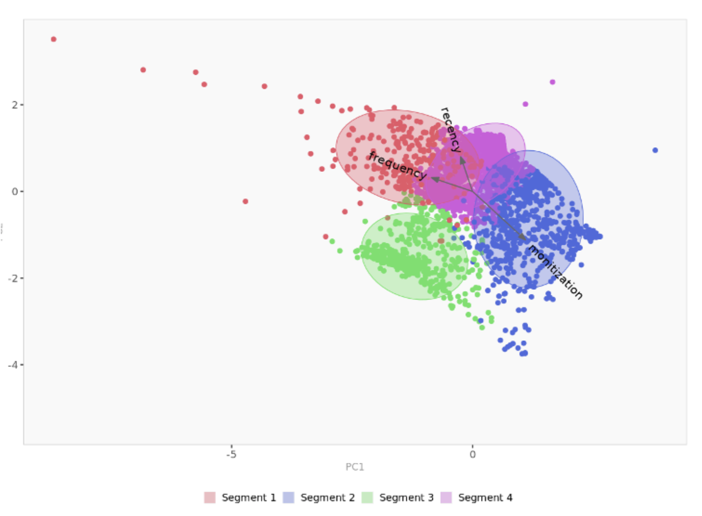

# Sample: Analysis Report for XXX (Startup)

## Summary: 
- Healthy subscription retention ; customer acquisition varies dramatically between months, likely due to marketing campaigns. 
- A segmentation by recency, frequency and monetization gives a four cluster solution:  22% of the most valuable/loyal customers, 57% of new users, and 21% of trifling users for the recent one-year period. 
- The most loyal customers are slightly older, relatively more men, and have a habit of sharing screenshots. 
- 8% of users seem active on the platform but fail to convert to subscribers. The company might need to figure out the cause of this.  We suspect these might be users that are highly active on the platform but do not convert at the end of the trial period.
- New users seem to include more women.  Users with the highest churn are slightly younger men who set losing weight as their goal. Either the app doesn’t fill the demand of this group well or the cohort tends inherently to give up more easily.

## Analysis for Monthly Subscription Retention for Cohorts by Time
- On a monthly basis, the app’s subscription retention rate looks healthy or even good, though it is hard to compare with related benchmarks.  I assume this can be due to the fact that customers who decide to start a trial subscription in the app are those who already have high intentions to spend a decent amount of time on fitness practice. People can’t log in to the app until they start the trial. So relatively high retention should be expected. Specifically, subscription retention for 3-month, 6-month and 12-month are 74%, 58% and 50% (estimated) respectively. More than half of the customers still on their subscription over time (see below charts for cohort retention). 
- The table below also indicates that more recent users are less likely to retain for the same period of time (e.g. 3-month retention rate is actually declining by cohorts)
- However, here notice that its customer acquisition power fluctuates. 

  
  <em>Monthly Subscription Retention for Cohorts by Time</em>

## Customer Segmentation by Recency, Frequency, and Monetization (RFM Model)
Customer segmentation analysis is conducted based on the magnitude of recency and frequency of app usage by customers and the total revenue contributed from them. Then a descriptor analysis is followed to mark the distinguishing demographic descriptions to each segment. This gives a better understanding of the profile of each customer cohort and makes it possible to infer causality and customize operation/marking strategies in turn. 

The analysis focuses on the measurement of three metrics based on the period between 12/15/2020 and 11/04/2021 on 3134 customers. There are defined as follow:
 - Recency: How many days the latest time the user used the app since the beginning date of the window 12/15/20. So the higher this number is, the more recent it indicates to the date.
- Frequency: On average, how frequently the user uses the app in a week.
- Monetization: How much money has the user spent so far within the period specified. 

Firstly, we have the mean of these three metrics to show the average magnitude of the whole population. 

  
  <em>Segment Stats Profile</em>

On average, the latest days users use the app was 60 days ago (60=325-265), including users churned in the early days; and people who work out on the app 3 times a week; The Average revenue users contributed is around $300. 

## Segmentation
The model at the end gives a four-segmentation solution for these customers. See the result below:

  
  <em>Segment Summary</em>

In the table above, segmentation variables that are statistically different from the rest of the population are highlighted in red (lower) or green (higher). Interestingly, each segment intuitively shows different attributes of recency, frequency, and monetization. And we can analyze them by the diagram below:
  

  
  <em>Recency, Frequency, Monetization by Segments</em>

  
Cell colors indicate to what extent a segment is statistically different from the rest of the population on each segmentation variable. It turns out that we can directly define each of the groups by their distinguishing attributes. From left to right, they can be defined as below:
- Active Users: They actively use the app though they don’t necessarily contribute revenue.
- Trifling Users: They have churned and done nothing on the app.
- High-value Users: Loyal customers who have stuck to the app with high profitability.
- New Users: Customers who just start to use and explore the app

Checking the size of each segment:

  
  <em>Segment Size Summary</em>

   
Their sizes have shown the imbalance of the segments as a great reflection of the 20/80 principle such that around 20% (8%+14% = 22%) users account for the most valuable customers (Active Users + High-value Users). Such groups would be the focus of the team with the maximum support.

  
  <em>Spatial Representation of Segments</em>

Then this diagram displays the spatial representation of segments and segmentation variables, using principal component analysis. It is a useful guide to see which segmentation variables are correlated and the relationship between segments in a visual perspective.

It’s very helpful to identify different cohorts which characterize different behaviors on the app and different interaction patterns with the app. However, segments based on descriptors that we selected would give a better sense of how they differ from each other with regard to demographic information. 

## Descriptor Analysis
Though limited to the dataset, a few demographic attributes and behavior preferences still have been used to describe the segments formed. They are age, gender, height, habit on screenshots, and workout goals of individuals. (some other useful attributes such as weight and attributes of coach assigned were not included)

  
  <em>Descriptor Stats Details by Segements</em>

The average values of each descriptor, overall and within each cluster are summarized. Descriptors that are statistically different from the rest of the population are highlighted in red (lower) or green (higher).

  
  <em>Representative Descriptors by Segements</em>

To wrap up two diagrams, we can tell each segment maps to their special descriptions of demographic information and behavior preferences.
- Active Users (Segment 1): These people are relatively older (35-year) men who like to take screenshots. They stick to the app and enjoy the experience by recording their efforts and sharing their joys. This is a group that needs some attention for improvement as it indicates they haven’t been contributing revenue for the company though they are active on the App.
- Trifling Users (Segment 2): They are relatively younger (32-year old) men who don’t explore the app that much (screenshots) and seem to bear the ambition of losing weight as their goal. Assumption 1 here is that people are more chubby and lack the perseverance to continue. Alternatively, assumption 2 is that the app is less helpful to meet the demand of this overweight customer cohort.
- High-value Users (Segment 3): In expectation, this group shares the same demographic attributes and behavior pattern as the active users (Segment 1).
- New Users (Segment 4):  It indicates that our new users are more women who aim less at losing weight (so more at other goals like getting healthier or building muscles). It’s good to see more women are joining the app.

